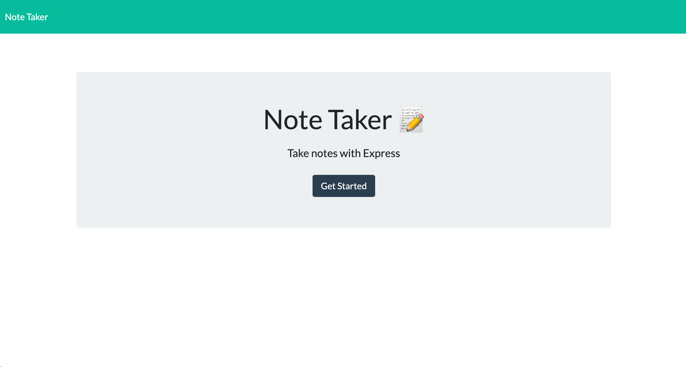

# 11 Note Taker

## Your Task

This application is called Note Taker and can be used to write and save notes. This application uses an Express.js back end and saves and retrieve note data from a JSON file.

The application has been deployed to Heroku.


## User Story

```
AS A small business owner
I WANT to be able to write and save notes
SO THAT I can organize my thoughts and keep track of tasks I need to complete
```


## Screenshot

The following image shows the Note Taker application's appearance and functionality:



Heroku Link to application:
<https://note-taker-arshleen.herokuapp.com/>

The URL of the GitHub repository is: 
<https://github.com/ArshleenKNagpal/note-taker>


- - -
© 2021 Trilogy Education Services, LLC, a 2U, Inc. brand. Confidential and Proprietary. All Rights Reserved.
